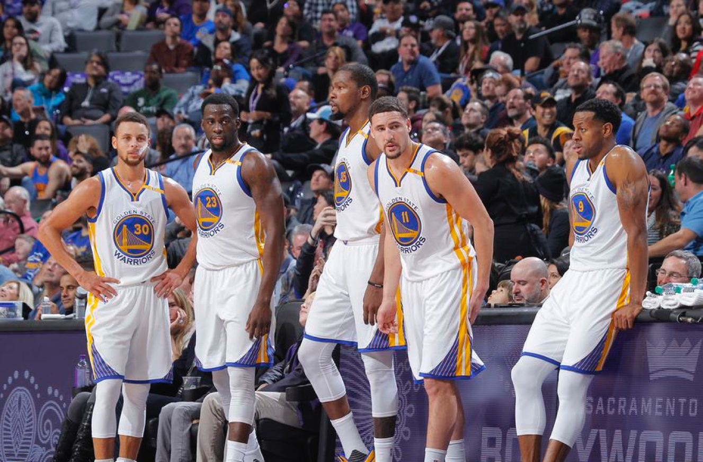
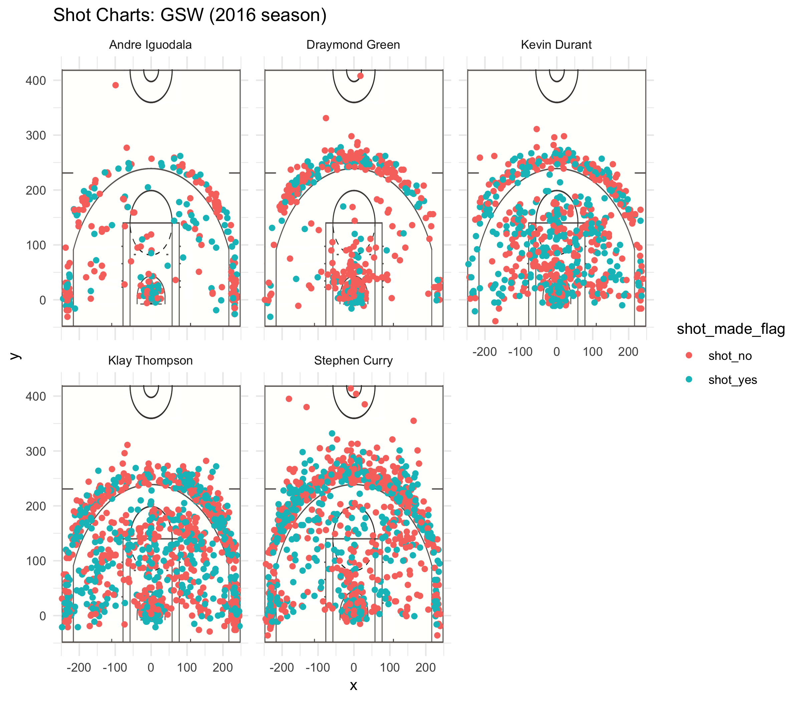

```{r}
library(dplyr)
combined <- read.csv("../data/shots-data.csv", stringsAsFactors = FALSE)
combined$made_2 <- 0
combined$attempted_2 <- 0
combined$attempted_2[combined$shot_type == '2PT Field Goal'] <- 1
combined$made_2[combined$shot_type == '2PT Field Goal' & combined$shot_made_flag == 'shot_yes'] <- 1
combined$attempted_3 <- 0
combined$attempted_3[combined$shot_type == '3PT Field Goal'] <- 1
combined$made_3 <- 0
combined$made_3[combined$shot_type == '3PT Field Goal' & combined$shot_made_flag == 'shot_yes'] <- 1
combined$total_shots <- 1
combined$total_made <- combined$made_3 + combined$made_2

two_point_shooting <- arrange(summarise(
  group_by(combined, name),
  total= sum(attempted_2),
  made = sum(made_2), 
  perc_made = 100 * made/total), desc(perc_made))

three_point_shooting <- arrange(summarise(
  group_by(combined, name),
  total= sum(attempted_3),
  made = sum(made_3), 
  perc_made = 100 * made/total), desc(perc_made))


total_shooting <- arrange(summarise(
  group_by(combined, name),
  total= sum(total_shots),
  made = sum(total_made), 
  perc_made = 100 * made/total), desc(perc_made))
```


#How Kevin Durant has Added Versatility and Efficiency to the Golden State Offense


```{r out.width='80%', echo=FALSE, fig.align='center'}

```


Imagine taking the greatest shooting team in NBA history and then adding one of the greatest shooters of all time to that very team. That’s what the Golden State Warriors did with Kevin Durant. The 2015-16 Warriors were the greatest three-point shooting team in history. Between Steph Curry, who scored a record-setting 402 three-pointers, and Klay Thompson who scored 281, the Warriors dominated opponents with their three-point game on their way to a 73-9 regular season record. After losing a close NBA finals, they added Kevin Durant to their team, well renowned as the second best player in the league and a Hall of Fame shooter. In this article, we’ll examine the shooting patterns of the new Warriors lineup and how they’ve incorporated Kevin Durant into the team. 

```{r echo=FALSE}
total_shooting
```

From the first table above, we can see that Kevin Durant has the highest shooting percentage on the team. Durant is a shooter who takes shots at a high volume without sacrificing efficiency. The fact that he has taken less shots than Curry and Klay this season can be explained by the fact that he missed almost a fourth of the season due to injury. He’s averaging just as many shots per game as his fellow teammates and with a higher percentage, a remarkable accomplishment considering the quality of his All-Star teammates and the fact that he’s had to adjust to a new system. Andre Iguodala, the Warriors’ first man off the bench, is another great shooter providing quality alongside the substitutes. Kevin Durant’s and Andre Iguodala’s high shooting percentages can also be explained by the fact that they generally take more 2s than 3s, a shot which is generally easier to take. 

```{r echo=FALSE}
three_point_shooting
```


If we focus on just three-point shooting, there’s still no beating Klay Thompson and Steph Curry. The two best three-pointers shooters in the league are both are on the same team and they’re both shooting a ridiculous percentage, well higher than the league average of 36%. Steph and Klay haven’t scored as many 3s as they did last season because they’ve had to share the ball more, but they’re still just as efficient with their shots. Their shooting percentages of 42.4% and 40.8% on high volume still power their offense. Kevin Durant’s 38.6% three-point shooting percentage is also incredibly impressive and the fact that he’s only the third best three-point shooter on the team shows just how spoiled the Warriors are with their offensive talent. 

Andre Iguodala shoots a respectable 36% from three, which is impressive as a bench player and is more than enough for the Warriors given their other offensive options. Draymond Green, a player more renowned for his defensive output than offensive output shoots only 32% from three, but his low volume of shots means he doesn’t hinder the team’s offense. 

```{r echo=FALSE}
two_point_shooting
```

If we focus on two-point shooting, it’s clear Kevin Durant is the best shooter on the team. Though Iguodala shoots at a higher percentage, Durant shoots at a much higher volume with just as high efficiency, a more impressive trait for any shooter. Kevin Durant has always been known for his midrange game and he is an incredibly efficient two-point shooter. His percentage of 60.7% destroys the league average of 50%, making his two-point shot as much of a weapon as Steph and Klay’s three-point shot. On average, his two-point shot generates 1.21 points, whereas Steph’s three-point shot generates 1.22 points and Klay’s three-point shot generates 1.27 points. These numbers were calculated by multiplying the value of the shot (either 2 or 3) by the shooting percentage of the shot. Durant also takes a large volume of two-point shots as well, the most of the team, despite the fact he missed so many games from injury. 

Steph and Klay are also above average two-point shooters, which adds versatility to their game despite the fact that they are primarily three-point specialists. Steph’s speed and dribbling ability in particular often allow him to blow by his defender for an easy layup. This means that opposing players can’t only guard Steph and Klay from the three-point line because they can just as easily drive to the hoop and score a layup or midrange shot. 

Draymond’s two-point shooting percentage is basically league average, which is great for a player whose main role comes on the defensive end. As long as Draymond shoots the ball at a league average, opposing defenders must still guard him, which gives better shooters on the team more space to score.

Finally, we can see that Iguodala’s two-point shooting percentage is actually the highest on the team, which is odd since he’s not exactly known for his shooting. Does his percentage imply he’s the best shooter on the team? Not exactly. We’ll examine this further by looking at the specific locations from which the players take their shots.  

```{r out.width='80%', echo=FALSE, fig.align='center'}


```


From the graph above, we can see that Andre Iguodala’s high shooting percentage can be explained by the fact that most of his two-point shots are right next to the rim. He generally scores layups and dunks rather than deep midrange two-point shots. Layups and dunks are high percentage shots, which give him the highest two-point shooting on the team. The fact that he generally only takes these shots also explains his low volume of shooting since opportunities to take shots that close to the rim are rare in the game. Draymond Green’s shooting chart also looks very similar to Iguodala’s in the sense that most of his two-pointers generally come from layups or dunks. 

Kevin Durant, Klay Thompson, and Steph Curry are all players who take shots all across the court. They’re all volume shooters which means they take a lot of shots every game, which traditionally leads to them having to take more difficult shots. However, these players are such elite shooters that they can take these more difficult shots without sacrificing shooting efficiency. Despite their high volume, all of them are among the league leaders in shooting efficiency. The fact that all three of them shoot the ball so well from both the two-point and three-point range means that defenders can never leave any of them unguarded for even a second. This means their teammamtes can never be double teamed, giving them more space to operate and allowing them to take better shots. 

Through this analysis, it is evident that Kevin Durant has fit the Warriors like a glove. There were questions when he arrived about whether he could fit the Warriors pass-first game, but he has more than answered those questions. He takes shots just as often as Steph and Klay, but still manages to only take efficient shots with high volume. His two-point game has added versatility to an offense mostly known for its three-point shooting and his presence on the court has given his teammates more opportunities to take efficient shots as well. Without a doubt, the incredible Warriors offense from last year has only gotten year. The Warriors will be an incredibly difficult team to beat this postseason and are almost a lock to win the championship.
